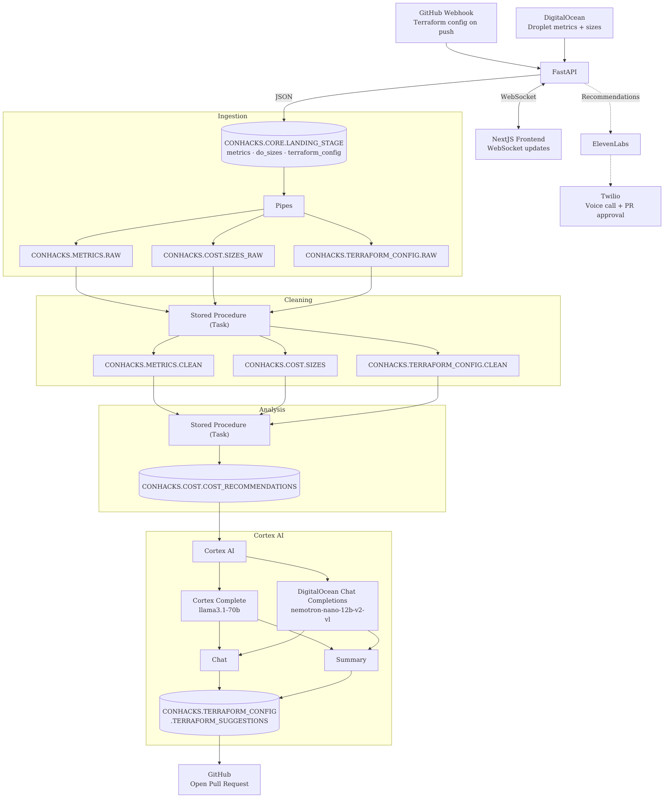

My team and I competed at ConHacks 2026, hosted at the Waterloo campus of Conestoga College. The hackathon lasted for 36 hours, April 28th to 30th. We won the MLH best use of DigitalOcean award for InfraLens, an AI-powered infrastructure optimization agent. You can check out our submission on [Devpost](https://devpost.com/software/infralens).

# the problem

Cloud bills are full of waste. It is quite common to have infrastructure that costs more than it needs to, and for engineers, monitoring and addressing this is additional overhead that, sincerely speaking, none of us want to deal with. So why not automate it?

InfraLens does this by ingesting DigitalOcean metrics into Snowflake, running heuristic analysis to identify right-sizing opportunities, and opening pull requests containing the recommended changes directly to the repository containing the declarative infrastructure configuration.

# the pipeline

The system runs data through four stages. Ingestion feeds into cleaning, which feeds into analysis, and then AI summarization.

**Ingestion** starts with two sources. A GitHub webhook fires whenever Terraform files change, and a polling agent pulls live droplet sizes and CPU/memory metrics from DigitalOcean. Both streams are sent to the FastAPI backend as JSON, which loads them into a Snowflake landing stage. Snowflake Pipes pick them up from there and load them into raw tables.

**Cleaning** is handled by Snowflake Tasks running stored procedures on a schedule. They normalize the raw data, flattening JSON, coercing types, and joining metrics against the DigitalOcean size catalog so we have both utilization and cost in the same place.

**Analysis** is another stored procedure that runs the rightsizing logic. It looks at p95 CPU and memory utilization for each resource and finds the smallest droplet size that would still comfortably handle the load. If that size is cheaper than what is currently provisioned, a recommendation row gets written to `CONHACKS.COST.COST_RECOMMENDATIONS` with the old size, new size, estimated monthly savings, and a reason.

**Cortex AI** takes those recommendation rows plus the relevant Terraform config and generates plain-English explanations via Snowflake Cortex (llama3.1-70b). The explanations are stored in `CONHACKS.TERRAFORM_CONFIG.TERRAFORM_SUGGESTIONS` and end up in both the dashboard and the PR body. Midway through the hackathon Cortex became unavailable, so we pivoted to DigitalOcean's Chat Completions endpoint (nemotron-nano-12b) as a fallback. Both are wired in.

# the output

When recommendations are ready the backend opens a pull request against the user's Terraform repository. The PR includes the diff, the AI-generated explanation, and the estimated savings. It fits into the existing code review workflow with no extra tooling required.

We also added a voice call feature powered by ElevenLabs and Twilio. When significant savings are identified, the system calls the user to summarize what was found. If the user approves through the call, a pull request can be created on the spot, provided they can authenticate themselves. The voice synthesis and the conversational logic for the call run through DigitalOcean's Chat Completions endpoint. It started as a demo idea and ended up reinforcing the core premise well. The savings find you.

The frontend is a React app that connects over WebSockets to get live pipeline progress updates as stages complete, and a dashboard with recommendation cards that show the Terraform diffs and savings estimates.

# what went wrong

The most frustrating issue was webhook idempotency. GitHub can replay webhooks and we had to be careful to avoid duplicate snapshots and redundant analysis runs. HMAC validation and deduplication checks ended up being more work than expected.

Real-time progress streaming was another challenge. We used an in-process asyncio pub/sub event bus to push stage completion events to the frontend over WebSockets without Redis. It worked, though it was more fragile than we would have liked.

And then Cortex AI went down midway through. That forced the pivot to DigitalOcean's endpoint, which was fine in the end, but losing a core integration mid-hackathon is a stressful experience.

# team

InfraLens was built by Devyansh Raj, Stephen Adebambo, Devang Parekh, and James Liang.
